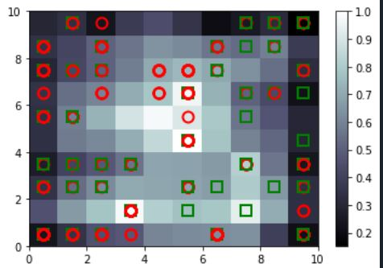

# Self-Organizing-Maps
Python implementation of the unsupervised Deep Learning Algorithm SOM

# About
A self-organizing map (SOM) is a type of artificial neural network (ANN) that is trained using unsupervised learning to produce a low-dimensional (typically two-dimensional), discretized representation of the input space of the training samples, called a map, and is therefore a method to do dimensionality reduction.

To read more about SOMs, check out this [link](https://towardsdatascience.com/self-organizing-maps-ff5853a118d4)



#Dataset
The dataset Credit_card_applications.csv is contains several unnamed columns which are used to determine if the transaction conducted was fraudulent or not. It can be downloaded from
the repository.

## How to Use
1. Download the dataset and set the folder containing the downloaded data as the working directory. 

2. Make sure you have all the libraries used in the som.py file. In case you need to download any of the libraries, use this command on your Command Prompt:
```
pip install 'your library name'
```

3. Once you have all the libraries imported, copy the code from som.py and run it.


